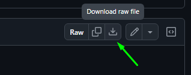
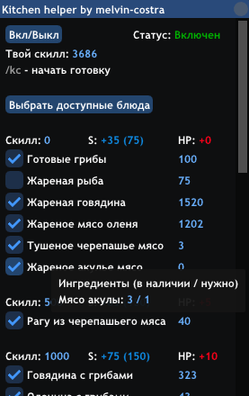

# 🎣 Скрипт для кухни (Samp-Rp)

## 📥 [**Скачать kitchen_helper.lua**](kitchen_helper.lua)

> Перенесите файл `kitchen_helper.lua` в папку `moonloader`.

  

---

## 🔧 Функции

- **Вкл/Выкл** — включает или выключает скрипт.
- **Выбор блюд** — включает или выключает приготовление блюда. Доступно в меню скрипта `/kh`.
- **Приготовление еды** — автоматически готовит указанные в меню блюда по порядку.
- **Остановка готовки** — останавливает приготовление еды при нажатии на клавишу `R` либо при повторном вводе команды `/kc`.

---

## 📦 Требования
Для корректной работы скриптов необходимо правильно установить все зависимости в указанном порядке:

- **SAMP 0.3.7 R1** — версия игры, необходимая для работы большинства модификаций.
- **ASI Loader** — необходим для работы CLEO (обычно идет в комплекте).
- **CLEO 4.x** — требуется для работы SAMPFUNCS.
- **SAMPFUNCS 5.4.1** — необходимый плагин для работы MoonLoader.
- **MoonLoader 0.26** — основа для работы данного скрипта.

### ➕ Дополнительные библиотеки
Для работы скрипта также требуются:
- **SAMP.lua** — обработка событий происходящих между игроком и сервером (получение/отправка сообщений, координат, диалогов и т.д.).
- **imgui** — библиотека для создания пользовательского интерфейса.

> ⚠ **Важно:** MoonLoader может конфликтовать с **SAMP Addon** и **ModLoader**.

### 🔗 Ссылки на загрузку
- **CLEO** - https://cleo.li/
- **SAMPFUNCS** - https://www.blast.hk/threads/17/
- **MoonLoader** - https://www.blast.hk/threads/13305/
- **SAMP.lua** - https://www.blast.hk/threads/14624/
- **imgui** - https://www.blast.hk/threads/19292/

## ▶ Команды

- `/kh` - открыть меню скрипта
- `/kc` - начать приготовление еды

## 🔒 Безопасность

> «А что если в скрипте стиллер или вредоносный софт? Как я могу тебе доверять? Кто ты такой вообще?»

- **Открытый исходный код** — все мои скрипты прозрачны и доступны для аудита.
- **Официальные источники** — все ссылки на зависимости ведут только на проверенные ресурсы.
- **Никаких автообновлений** — скрипты не подгружают лишний код без вашего участия.

### 🔍 Проверка исходного кода
Чтобы проверить безопасность скрипта, вам не обязательно знать язык программирования. Всё, что нужно:
1. Открыть любой AI-инструмент ([ChatGPT](https://chatgpt.com/), [Perplexity](https://perplexity.ai/), [Gemini](https://gemini.google.com/)).
2. Скопировать исходный код скрипта из [репозитория](https://github.com/melvin-costra/kitchen-helper/blob/main/kitchen_helper.lua).
3. Вставить код в чат с AI и попросить проанализировать его на наличие вредоносного кода.

## 📢 Связь

Подпишись на мой телеграмм канал и будь в курсе обновлений - https://t.me/melvin_costra

Для общения заходи в группу - https://t.me/+Fax0NDX1c242YmUy
